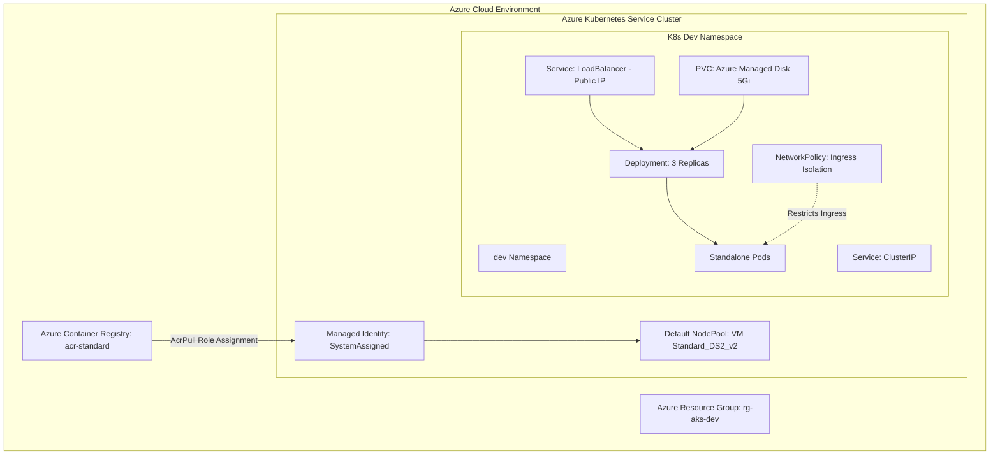

# ☸️ Azure AKS Provisioning & Kubernetes Workload Deployment

<p align="center">
  
</p>

<p align="center">
  
  
  
  
  
</p>

---

## 📌 Project Overview

This repository demonstrates **Infrastructure as Code (IaC)** using **Terraform** to provision a production-ready **Azure Kubernetes Service (AKS)** cluster along with an **Azure Container Registry (ACR)** using a **Generic Reusable Terraform Module**. 

Additionally, it covers hands-on cloud-native application orchestration by deploying complete **Kubernetes Workloads** across multiple namespaces using declarative YAML manifests.

---

## 🏗️ Architecture & Deployment Flow



---

## 💡 Key Kubernetes & Infrastructure Concepts Implemented

### 1. 🏗️ Generic Reusable Terraform AKS Module (`modules/aks`)
* **Parameterization**: Fully configurable input variables for cluster name, resource group, VM sizes, node counts, and ACR settings.
* **ACR & AKS Integration**: Provisions Azure Container Registry alongside AKS and automatically grants `AcrPull` permissions to the AKS Kubelet System-Assigned Identity via Azure RBAC role assignments.
* **Infrastructure Outputs**: Outputs sensitive cluster config (`kube_config_raw`), login servers, and resource IDs for downstream automation.

### 2. 📦 Namespaces (`kubernetes/01-namespaces`)
* **Multi-Tenancy & Isolation**: Logical separation of cluster resources into `dev` and `qa` environments to enforce scope, quota, and access control.

### 3. 🚀 Pods (`kubernetes/02-pods`)
* **Workload Execution**: Declarative specifications for standalone container pods (`nginx`, `firefox`) with explicit CPU/Memory resource requests and limits (`requests` and `limits`).

### 4. 🔄 Deployments (`kubernetes/03-deployments`)
* **High Availability & Scalability**: Manages a set of 3 replicated pods with automated self-healing.
* **Zero-Downtime Rolling Updates**: Configured with `RollingUpdate` strategy (`maxSurge: 1`, `maxUnavailable: 0`).
* **Health Probes**: Integrated `livenessProbe` and `readinessProbe` to monitor pod health before routing traffic.

### 5. 🌐 Services (`kubernetes/04-services`)
* **ClusterIP**: Internal microservice discovery and communication endpoint accessible only within the cluster.
* **LoadBalancer**: Exposes applications externally to the public internet by provisioning a native **Azure Public IP** via the Azure Cloud Provider integration.

### 6. 💾 Persistent Volume Claims (PVC) (`kubernetes/05-pv-pvc`)
* **Stateful Storage Provisioning**: Dynamically requests non-volatile storage backed by Azure Managed Disks (`managed-csi` StorageClass), ensuring data persistence across pod restarts and rescheduling.

### 7. 🔒 Network Policies (`kubernetes/06-network-policies`)
* **Zero-Trust Microsegmentation**: Fine-grained network security firewall rules controlling Ingress traffic between specific Pod labels (`podSelector` & `matchLabels`).

---

## 🛠️ Technology Stack

<p align="center">
  
</p>

| Component | Technology | Purpose |
| :--- | :--- | :--- |
| **Cloud Provider** | Microsoft Azure | Infrastructure Hosting (AKS, ACR, Resource Group) |
| **IaC Tool** | Terraform (HCL) | Provisioning Generic Modules for AKS & ACR |
| **Orchestrator** | Azure Kubernetes Service | Container Management & Pod Scheduling |
| **Registry** | Azure Container Registry | Private Docker Image Storage |
| **Manifests** | Kubernetes YAML | Workload specs (Deployments, Services, PVC, NetPol) |

---

## 📂 Repository Structure

```text
Azure-AKS-Provisioning-and-Deployment/
├── modules/
│   └── aks/                        # Reusable Generic Terraform AKS Module
│       ├── main.tf                 # RG, AKS, ACR, & Role Assignment resources
│       ├── variables.tf            # Configurable module parameters
│       ├── outputs.tf              # Cluster & Registry outputs
│       └── providers.tf            # AzureRM provider requirements
├── AKS_Cluster/                    # Environment Root Caller
│   ├── main.tf                     # Calls module "aks"
│   ├── variables.tf            # Root input variables
│   ├── outputs.tf              # Root outputs pass-through
│   ├── provider.tf             # Azure provider config
│   └── terraform.tfvars.example# Example deployment configuration
├── kubernetes/                     # Kubernetes Manifests
│   ├── 01-namespaces/
│   │   └── namespace.yaml          # Dev & QA Namespaces
│   ├── 02-pods/
│   │   └── pod.yaml                # Standalone Pod specs with limits
│   ├── 03-deployments/
│   │   └── deployment.yaml         # Scalable Deployment & Health Probes
│   ├── 04-services/
│   │   └── service.yaml            # ClusterIP & Azure LoadBalancer Services
│   ├── 05-pv-pvc/
│   │   └── pvc.yaml                # PersistentVolumeClaim (managed-csi)
│   └── 06-network-policies/
│       └── networkpolicy.yaml      # Pod Ingress Security Policies
└── README.md                       # Project Documentation
```

---

## 🚀 Step-by-Step Deployment Guide

### Prerequisites
* [Azure CLI](https://docs.microsoft.com/en-us/cli/azure/install-azure-cli) logged in (`az login`)
* [Terraform](https://www.terraform.io/downloads) (>= v1.3.0)
* [kubectl](https://kubernetes.io/docs/tasks/tools/) CLI installed

---

### Step 1: Provision Infrastructure via Terraform

```bash
# Navigate to the environment configuration directory
cd AKS_Cluster

# Initialize Terraform modules and providers
terraform init

# Create your custom variable file (optional)
cp terraform.tfvars.example terraform.tfvars

# Review execution plan
terraform plan

# Apply infrastructure changes
terraform apply -auto-approve
```

---

### Step 2: Connect `kubectl` to AKS Cluster

```bash
# Retrieve credentials from Azure CLI to update your local kubeconfig
az aks get-credentials --resource-group rg-aks-dev --name dev-aks-cluster

# Verify nodes status
kubectl get nodes -o wide
```

---

### Step 3: Deploy Kubernetes Workloads

```bash
# 1. Create Namespaces
kubectl apply -f ../kubernetes/01-namespaces/

# 2. Deploy Standalone Pods
kubectl apply -f ../kubernetes/02-pods/

# 3. Create Scalable Deployment
kubectl apply -f ../kubernetes/03-deployments/

# 4. Expose Services (ClusterIP & LoadBalancer)
kubectl apply -f ../kubernetes/04-services/

# 5. Provision Persistent Volume & Mount to Pod
kubectl apply -f ../kubernetes/05-pv-pvc/

# 6. Apply Ingress Network Isolation Policy
kubectl apply -f ../kubernetes/06-network-policies/
```

---

### Step 4: Verification & Inspection Commands

```bash
# Check all resources in the 'dev' namespace
kubectl get all -n dev

# Check external LoadBalancer Public IP
kubectl get svc webapp-loadbalancer-service -n dev

# Verify PersistentVolumeClaim Status (Bound)
kubectl get pvc -n dev

# Check detailed Pod status & event logs
kubectl describe deployment webapp-deployment -n dev
```

---

## 🧹 Cleanup Instructions

To avoid incurring unexpected Azure cloud costs, tear down the infrastructure when finished:

```bash
cd AKS_Cluster
terraform destroy -auto-approve
```

---

## 👩‍💻 Author

<p align="center">
  <b>Priya Jaiswal</b><br>
  <i>Azure Cloud | DevOps | Infrastructure as Code | Kubernetes Orchestration</i>
</p>

<p align="center">
  <a href="https://github.com/Pjaisw1103">
    
  </a>
  <a href="https://linkedin.com/in/priya-jaiswal1103">
    
  </a>
</p>

---

<p align="center">
  ⭐ If you found this repository helpful, feel free to star it!
</p>
